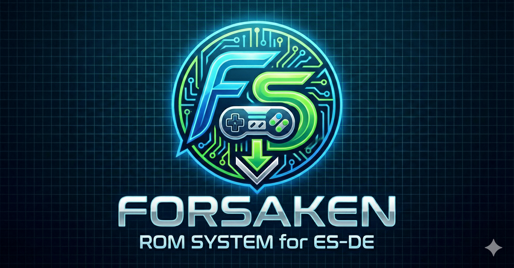

# Forsaken Emulator

**Forsaken Emulator** is a comprehensive automation toolkit designed to supercharge your [EmulationStation Desktop Edition (ES-DE)](https://es-de_org/) experience on Linux. It transforms your setup into a seamless "Click to Play" powerhouse by automating the retrieval of emulators, cores, and even ROMs.

## 🚀 Key Features

*   **Automated Emulator Management**: Automatically downloads and installs the latest AppImages for popular emulators, including:
    *   **DuckStation** (PS1)
    *   **PCSX2** (PS2)
    *   **RPCS3** (PS3)
    *   **Xenia** (Xbox 360)
    *   **RetroArch** (with a full suite of cores)
    *   And many more (Vita3K, Lime3DS, etc.)!

*   **Smart ROM on Demand**: Never worry about storage space again.
    *   **Bypass System**: The intelligence heart of the project. When you launch a game, `bypass.sh` checks if the ROM exists.
    *   **Auto-Download**: If a ROM is missing, it's fetched instantly from cloud storage.
    *   **Temp vs. Forever**: Choose whether to keep games permanently or play them once (Temporary Mode) to save disk space.

*   **Seamless Integration**:
    *   Updates your `es_systems.xml` and `es_settings.xml` automatically to point to the new robust ecosystem.
    *   Generates "Fake ROM" placeholders so your library looks full, even if the files aren't on disk yet.

*   **Progress Feedback**: Integrated `zenity` dialogs keep you informed about download progress and extraction status.
*   **Not included**: Some features are intentionally omitted to keep the project lightweight and focused. Also, the keys, bios, and other optional components.

## 📥 Installation

```bash
curl -L https://github.com/vguardiola/forsaken_emu/raw/refs/heads/main/install.sh | bash -C
```

## 🛠️ Setup

1.  Create a "emulators" folder inside ~/ES-DE/ folder
2.  Clone this repository or download the script and copy the content inside emulators folder.
3.  Make sure you have basic dependencies installed (the script will check for `7z`, `wget`, `unrar`, `zenity`, `jq`).
4.  Run the setup script:
    ```bash
    ./setup.sh
    ```
4.  Follow the on-screen prompts to download emulators and generate your game lists.

## 📂 Structure

*   `setup.sh`: The main installer script.
*   `Forsaken/bypass.sh`: The launcher wrapper that handles ROM logic.
*   `Forsaken/config.sh`: The emulators config app.
*   `Forsaken/config.json`: Configuration file defining emulator commands and system settings.
*   `lists/`: Directory containing game databases for the "Fake ROM" generator.

## 🎮 Supported Systems

Support includes but is not limited to:
*   Nintendo (NES, SNES, N64, GC, Wii, WiiU, GB/GBC/GBA, DS, 3DS)
*   Sony (PS1, PS2, PS3, PSP, PS Vita)
*   Sega (Master System, Genesis, Saturn, Dreamcast)
*   Microsoft (Xbox, Xbox 360)
*   And classic computers (Amiga, C64, MSX, etc.)


## 📝 License

This project is licensed under the MIT License – see the [LICENSE](LICENSE) file for details.

## 🙏🏻 Thanks

*   [Arley4d](https://github.com/Arley4d) for the roms list and the inspiration for this project.


